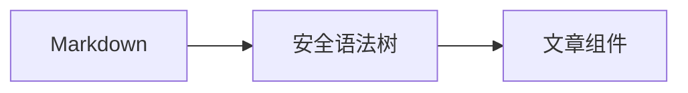

# Markdown 与富内容示例

这份文件是 Altria 的写作示例，不会加入文章列表。元数据写在文章开头的 `---` 中；普通文章依旧放在 `content/posts/`，英文和日文分别在 `en/`、`ja/` 目录。

```yaml
---
title: 文章标题
description: >-
  可以折行填写的文章简介。
date: 2026-10-01 10:00:00
published: 2026-10-01T12:00:00+08:00
updated: 2026-10-02
categories: [技术, 前端]
tags:
  - Markdown
  - Next.js
image: /images/sea.jpg
recommend: 5
type: tech
hideInfo: false
coverDim: true
coverFilter: brightness(0.8) saturate(0.9)
authorship: human-ai-polished
seo:
  title: 搜索结果标题
  description: 搜索结果简介
references:
  - title: Markdown 文档
    link: https://commonmark.org/
aside: [toc, meta-aside-resources]
---
```

旧的 `category`、逗号分隔 `tags`、`cover`、`featured` 仍可用。`cover: false` 关闭封面。`draft: true` 不发布。URL 始终取本地文章文件名，`permalink` 不改写已有地址。`type: story` 使用叙事排版。`hideInfo` 隐藏标题旁的信息行；`coverDim` 调暗封面，`coverFilter` 可填写 CSS 内建滤镜并优先于 `coverDim`。创作声明只展示显式填写的 `human-only`、`human-ai-polished`、`ai-human-reviewed`、`ai-only`。

## 标准 Markdown

**粗体**、*斜体*、***粗斜体***、~~删除线~~、`行内代码`、自动链接 <https://commonmark.org/> 、[引用式链接][spec]。

第一行两个空格结尾。  
这一行明确换行。

- [x] 已完成
- [ ] 待完成
  - 嵌套列表

1. 第一项
2. 第二项

脚注可以重复引用[^example]，再次引用[^example]。

[spec]: https://spec.commonmark.org/ "CommonMark"
[^example]: 脚注正文支持 **格式** 和 [链接](https://commonmark.org/)。

## 提醒和折叠

::alert{type="warning"}
#title
一个 **重要提示**
#default
提示正文支持普通 Markdown。
::

::folding{title="展开查看步骤"}
### 折叠内的标题

这段内容也能通过目录定位。

  :::alert{type="tip" flat}
  嵌套的提示。
  :::
::

## 选项卡

::tab
---
tabs: [说明, 代码]
active: 1
---
#tab1
第一个选项卡的正文。

#tab2
### 代码选项卡标题

```ts [example.ts] wrap expand {2}
const greeting = "Hello";
console.log(greeting);
```
::

## 行内组件

:badge[文档]{link="https://commonmark.org/" round} ， :blur[点击或按 Enter 显示] ， :tip[解释文字]{tip="支持键盘聚焦"} ， :tip[可复制的文字]{copy} ， :key{cmd code="K"} ， :emoji-clock{datetime="2026-10-01 10:30:00" rotate}。

`const answer = 42`{lang="js" copy}

:copy{prompt="$" code="npm run dev" lang="sh"}

[允许指定文字颜色]{style="color: #008866"}，<mark>高亮标记</mark>，H<sub>2</sub>O，x<sup>2</sup>。

[叙事字体]{.text-story}、[阴影回声]{.text-repeat}、[随滚动缩放]{.text-zoom}。`type: story` 中的 `.title-like` 使用居中的标题样式。

## 卡片与图片

::link-card
---
title: Markdown 规范
description: 阅读语法规范
link: https://commonmark.org/
class: gradient-card active
---
::

::link-banner{title="博客首页" description="返回 Altria" link="/" banner="/images/sea.jpg"}
::

::card-list
- **第一张卡片**

  卡片正文。
- **第二张卡片**

  卡片正文。
::

::pic{src="/images/sea.jpg" alt="海岸"}
#caption
图片说明支持 **Markdown**。
::

## 订阅卡片与分组

::feed-card
---
author: Altria
sitenick: 关于本站
title: 关于 Altria
link: /about
avatar: /icon.jpg
icon: /icon.jpg
date: 2026-10-01
archs: [Next.js, React]
desc: 这里填写作者自己的站点说明。
feed: /rss.xml
comment: 点击详情、悬停或键盘聚焦查看完整信息。
---
::

::feed-group
---
name: 本站页面
desc: 仅演示文章内的分组写法。
shuffle: true
entries:
  - author: Altria
    sitenick: 关于
    link: /about
    avatar: /icon.jpg
    desc: 站点介绍
  - author: Altria
    sitenick: 归档
    link: /archives
    avatar: /icon.jpg
    desc: 文章归档
---
::

`shuffle` 开启初次随机排序，也可点击随机/恢复按钮；按住 Ctrl/⌘ 点击分组标题恢复原序。地址附加 `?shuffle=false` 可关闭首次随机。卡片不会自动抓取任意站点资料。

## 诗歌、引用、聊天和时间线

::poetry{title="清晨" author="示例" footer="排版示意"}
第一行文字
第二行文字
::

::quote
一段值得摘录的话。
::

::md-title
不加入目录的样式标题
::

::chat
{读者}

这个组件支持什么？

{.作者}

普通 Markdown、图片和代码。

{:系统}

对话结束。
::

::timeline
{2026-09}

开始记录。

{2026-10}

继续完善。
::

## 表格

| 内容 | 说明 | 对齐 |
| :--- | :---: | ---: |
| `代码` | 表头吸顶、滚动/换行切换 | 42 |
| 长文本 | very-long-value-without-any-natural-breaking-spaces | 100 |

## 数学公式

行内公式 $E = mc^2$。

$$
\int_0^1 x^2\,dx = \frac{1}{3}
$$

## 图表



## 乐谱

```music-abc
X:1
T:简单旋律
M:4/4
L:1/4
K:C
C D E F | G A B c | c B A G | F E D C |]
```

乐谱进入视口后加载播放控件；仅点击播放才会发声，音色资源不可达时乐谱和源码仍可读。

## 视频与仓库

::video-embed{type="youtube" id="dQw4w9WgXcQ"}
::

::github{repo="vercel/next.js"}
::

视频支持 raw、bilibili、bilibili-nano、youtube、douyin、douyin-wide、tiktok。raw 的 `id` 是视频 URL，可配 `poster`；嵌入平台的 `id` 是对应视频编号。外站失效或限制嵌入时保留原站链接。

## 元信息插槽

文章根级 `meta-*` 内容从正文提取。`meta-aside-*` 通过 frontmatter 的 `aside` 数组按顺序显示在文章侧栏；`meta-copyright` 在文章末尾显示。

````mdc
::meta-aside-resources{title="相关资源" card}
[Markdown 文档](https://commonmark.org/)
::

::meta-copyright{title="使用说明"}
这是作者自行填写的文章许可说明。
::
````

## 安全边界

MDC 行内组件之前留空格（例如 `文字 :badge[标签]`）；中文标点紧接裸 URL 时，建议用 `<https://example.com/>` 或普通链接语法。组件属性作为数据处理，支持内联属性、`:属性` JSON 和 YAML 属性块。`{{ ... }}` 不执行表达式；事件处理器、脚本和危险 URL 不会执行。可使用安全的 `details/summary/span/kbd/mark/sub/sup` 等 HTML；任意 iframe、script 和未识别 HTML 保留为文字。外部卡片只使用文章提供的数据，GitHub 卡片只查询明确指定的公开仓库。
